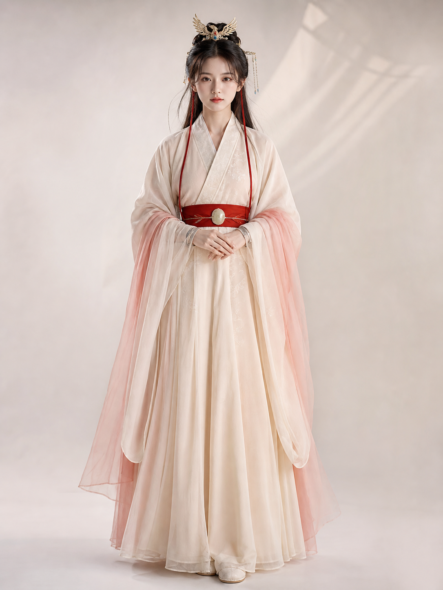
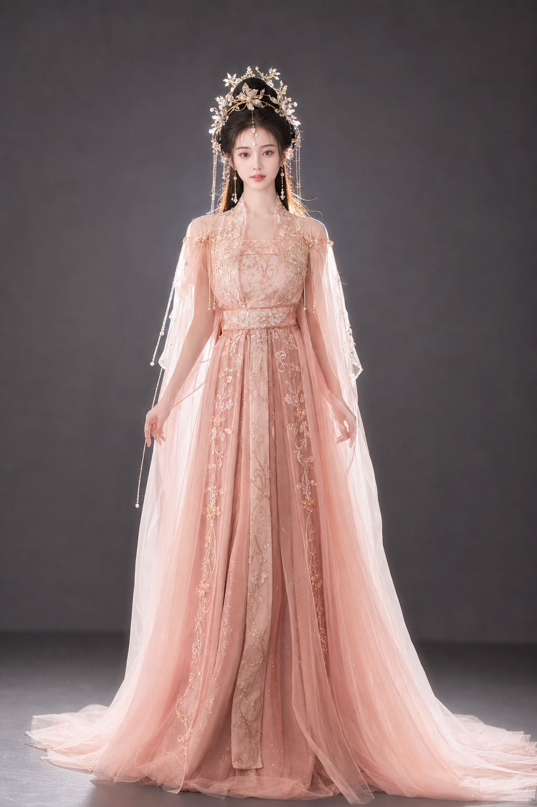

# 提示词收藏库

> 收藏效果不错的提示词，附生成图片存档。
> 格式：提示词 + 效果图 + 平台/模型标注

---

## 🗂️ 分类目录

- [人像](#人像)
  - [古风](#古风)
  - [现代](#现代)
  - [民国](#民国)
- [环境](#环境)
- [人物+环境剧照](#人物环境剧照)
- [艺术探索](#艺术探索)

---

## 人像

> 聚焦人物本身：面部特写、半身、全身人像，无需强调背景场景。

### 古风

#### P-G001 · 乌木长发古风仕女

**平台/模型：** _待填写_
**日期：** 2026-05-03
**评分：** ⭐⭐⭐⭐⭐

**提示词（中文）：**
```
写实风格照片

发型: 乌木色长发如瀑重至腰间，额前中分刘海呈微风拂乱感。头顶梳反绾惊鹊髻，斜插鋈金点翠步摇（正视图重点表现簪首的展翅凤纹），耳后两缕发丝用红丝带松系，飘带长度及肩。

服饰: 素白广抽交领糯裙，衣襟处暗绣银线兰花纹（需近观可见），朱砂红缎面腰封束出纤细轮廓，正中镶嵌椭圆形和田玉禁步，袖口呈半透明鲛绡质地，隐约透出手腕银镯轮廓。披帛为渐变霞色，从肩部垂落时，在臂弯形成流水状褶皱。

色彩规范:
主色: #F8F0E3（月光白）
辅色: #BE1F1F（绛红）
点缀色: #B5A495（古铜金）
特殊效果: 袖口与披帛，使用5%透明度叠加
```

**效果图对比：**

| Grok | FLUX | GPT Image | MJ |
|------|------|-----------|----|
| <!--  --> 📎待添加 | <!--  --> 📎待添加 |  | <!--  --> 📎待添加 |

> 命名规则：`P-G001-wumu-portrait-{模型缩写}.png`，放入 `assets/` 目录后取消注释即可显示

---

#### P-G002 · 粉色系古风仙侠全身正面像

**平台/模型：** _待填写_
**日期：** 2026-05-03
**评分：** _待评_

**提示词（中文）：**
```
超写实真人摄影写真，8K超清，照片级真实质感，专业古风人像摄影，全身正面像，16:9横向构图，全身入镜，头顶留少量空间，裙摆完整可见。

主体：年轻亚洲女性，瓜子脸，杏眼，冷白皮肤，细腻通透，五官精致柔美，清冷温柔又带疏离感，淡粉色唇妆，妆容干净仙气，高贵梦幻气质，五指清晰自然。

发型：古风高盘发或半盘发，发丝顺滑整洁，自然垂落至背部。

头饰：大型金银镂空花冠，花枝、蝴蝶、珍珠、水晶、宝石镶嵌，顶部孔雀羽装饰，头冠两侧垂挂长款珍珠水晶流苏步摇，细密珠链垂落肩部，额间宝石坠饰，配夸张长耳坠和多层珠宝项链。

服装：华丽古风礼服汉服，粉色系（桃粉、浅粉、金粉），层层叠叠轻纱、丝绸、披帛，宽大飘袖，衣身金银刺绣，纹样花藤、祥云、蝴蝶、灵鸟，点缀珍珠、水钻、宝石、金属雕花与细密珠链，裙摆宽大拖地。

背景：纯灰色暗调摄影棚背景，干净简洁，突出人物主体。

光影：电影级柔光，侧逆光轮廓光，柔和面光打亮面部，突出皮肤通透感、珠宝闪耀感与薄纱层次感。

整体：高贵梦幻、清冷仙气、华丽精致、东方仙侠风，照片级真实，不插画，不卡通。
```

**效果图对比：**

| Grok | FLUX | GPT Image | MJ |
|------|------|-----------|----|
| <!--  --> 📎待添加 | <!--  --> 📎待添加 | <!--  --> 📎待添加 | <!--  --> 📎待添加 |

> 命名规则：`P-G002-pink-xianxia-{模型缩写}.png`

---

### 现代

#### P-M001 · （占位）

**平台/模型：** _待填写_
**日期：** _待填写_

**提示词：**
```
（在此粘贴提示词）
```

**效果图：**
<!--  -->
> 📎 *图片待添加*

---

### 民国

#### P-R001 · （占位）

**平台/模型：** _待填写_
**日期：** _待填写_

**提示词：**
```
（在此粘贴提示词）
```

**效果图：**
<!--  -->
> 📎 *图片待添加*

---

## 环境

> 纯场景/景观，无人物或人物极小作为比例参照。

### E001 · （占位）

**平台/模型：** _待填写_
**日期：** _待填写_

**提示词：**
```
（在此粘贴提示词）
```

**效果图：**
<!--  -->
> 📎 *图片待添加*

---

## 人物+环境剧照

> 人物与场景并重，有叙事感、电影质感的构图。

### S001 · 冰蓝礼服仙侠剧照

**平台/模型：** Grok Imagine
**日期：** 2026-05-03
**评分：** ⭐⭐⭐⭐☆

**提示词（中文）：**
```
超写实古风仙侠美女，身着冰蓝色曳地礼服，裙摆轻盈拖曳，腰间佩戴精致白玉腰带，头戴华贵发冠，发丝细腻，神情冷艳高贵，站在飘渺云雾间的仙境石台上，仙气十足，背景为淡蓝色云海与远山，超高清，电影级光影，8K画质，完美面部细节
```

**提示词（英文）：**
```
Ultra-photorealistic ancient Chinese xianxia beauty, wearing an ice-blue floor-length ceremonial gown with a gently trailing skirt, adorned with an exquisite white jade waist belt, wearing an ornate imperial headdress, hair rendered with fine detail, expression cold and noble, standing on a mystical stone platform amid drifting celestial mist, ethereal immortal atmosphere, backdrop of pale blue cloud sea and distant mountains, ultra-high definition, cinematic lighting, 8K resolution, perfect facial detail
```

**效果图对比：**

| Grok | FLUX | GPT Image | MJ |
|------|------|-----------|----|
| <!--  --> 📎待添加 | <!--  --> 📎待添加 | <!--  --> 📎待添加 | <!--  --> 📎待添加 |

> 命名规则：`S001-xianxia-blue-gown-{模型缩写}.png`，放入 `assets/` 目录后取消注释即可显示

**备注：** 原始中文稿经校对（拖曳/神情/搭配/设定等错别字已修正）后翻译

---

### S002 · （占位）

**平台/模型：** _待填写_
**日期：** _待填写_

**提示词：**
```
（在此粘贴提示词）
```

**效果图：**
<!--  -->
> 📎 *图片待添加*

---

## 艺术探索

> 风格实验、跨界融合、灵感随手记，不拘分类。

### A001 · （占位）

**平台/模型：** _待填写_
**日期：** _待填写_

**提示词：**
```
（在此粘贴提示词）
```

**效果图：**
<!--  -->
> 📎 *图片待添加*

---

*最后更新：2026-05-03*
